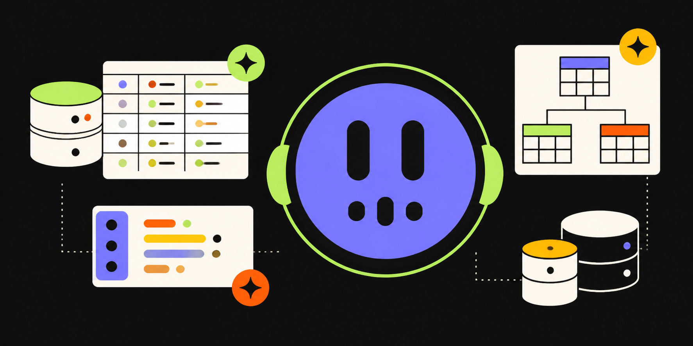

<p align="center">
  
</p>

<h1 align="center">Sarjy</h1>

<p align="center">
  An adaptive, voice-led SQL teacher.
</p>

I built Sarjy to explore one question: how can a SQL teacher adapt from real work instead of acting like a chat box beside an editor?

## What I built

Sarjy is a working SQL learning app with three connected parts:

- **Adaptive practice:** a short voice interview sets the first three questions, then evidence changes one task at a time.
- **A voice teacher:** Sarjy sees the open task, SQL, result, error, selection, and query plan.
- **A learner model:** attempts, retries, hints, confidence, voice requests, and explanations shape what comes next.

The project also includes query plan lessons, live weather data, and a profile that explains each next-step choice.

## Key choices

- **Keep the screen steady.** Passing or skipping replaces one card, not the whole queue.
- **Use proof, not guesses.** SQL runs in SQLite. Results, query plans, and work counts guide feedback.
- **Test transfer.** Follow-up tasks change the shape instead of repeating the same answer.
- **Give the model limits.** App rules control when Sarjy can reveal a hint, result, plan, or solution.
- **Show the reasoning.** The profile makes the learner model clear and lets the learner ask for more practice or move on.

## Main flows

- **Learn:** solve SQL tasks, get focused help, and receive an adaptive next task.
- **Optimize:** read a query plan, predict a change, test it, and explain the result.
- **Live data:** choose cities, query weather data, and connect the answer to a chart.

## Planning

Read the [product plan and technical design](./plan.md) for the problem, scope, system design, build phases, test plan, and tradeoffs.

## Run locally

You need Bun 1.3+ and a local or hosted libSQL database.

```bash
bun install
bun run db:push
bun run dev
```

Open [http://localhost:3001](http://localhost:3001).

Create `apps/web/.env`:

```dotenv
BETTER_AUTH_SECRET=<random value with at least 32 characters>
BETTER_AUTH_URL=http://localhost:3001
CORS_ORIGIN=http://localhost:3001
DATABASE_URL=file:../../local.db

# Voice teacher
ELEVENLABS_API_KEY=sk_...
ELEVENLABS_AGENT_ID=...
ELEVENLABS_WEBHOOK_SECRET=...

# Optional memory
OPENAI_API_KEY=sk-...
QDRANT_URL=https://...
QDRANT_API_KEY=...
```

Set up the voice teacher:

```bash
bun run --cwd apps/web setup:teacher
```

## Check the project

```bash
bun test
bun run check-types
bun run --cwd apps/web validate:curriculum
bun run --cwd apps/web verify:optimization
bun run build
```

Built with TanStack Start, React, SQLite, oRPC, Drizzle, Better Auth, ElevenLabs, Tailwind CSS, Bun, and Turborepo.

The visual system is documented in [`design.md`](./design.md).
