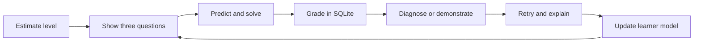
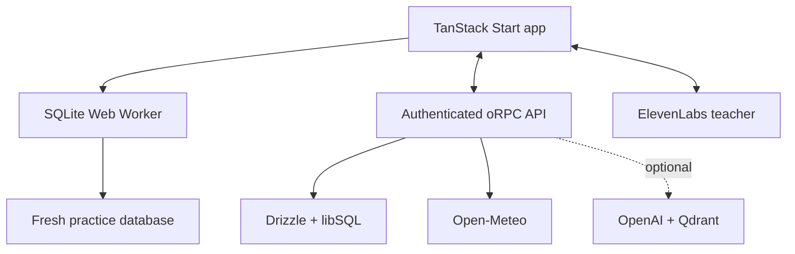

# Sarjy — Product & Technical Plan

This is the short PRD/TDD used to plan the case study and define what “done” means.

## Problem

Most learning systems expect every student to follow the same teacher, sequence, and pace. SQL platforms usually check the final query, but they do not know whether the learner guessed, used a hint, repeated the same mistake, or can explain why the answer works.

## Goal

Build a personal SQL teacher that estimates the learner’s level from real work, adapts the next exercise, teaches visually by voice, and verifies understanding—not just a correct result.

## Product principles

- Show only three assigned questions; never expose the full bank.
- Grade SQL with SQLite, never with the language model.
- Treat one exercise as one learning opportunity, even after many retries.
- Let Sarjy control the teaching surface, but keep lesson order deterministic.
- Use voice content as evidence only when the learner says something explicit; never infer ability, emotion, or learning style from acoustic behavior.
- Make the learner model visible, explainable, correctable, and forgettable.

## Scope

| Area | Planned experience |
| --- | --- |
| Learn | A short starting interview, three adaptive questions, real SQL execution, hints, retries, confidence, teach-back, and transfer practice. |
| Optimize | A step-by-step lab where the learner interprets, predicts, changes, compares, and explains a query plan. |
| Live Data | SQL missions built from historical weather for cities chosen by the learner. |
| Profile | A skill radar, session comparison, evidence details, misconceptions, calibration, and visible memories. |
| Sarjy | A voice teacher that sees the current screen, speaks, shows evidence, controls animations, and moves between questions through bounded tools. |

## Core learning loop

The curriculum has **207 executable questions across 16 concepts**: 64 anchors and 143 transfer questions. The adaptive policy replaces one card at a time using submitted work, confidence, misconceptions, hints, explicit voice requests, transfer evidence, and review timing.

Learners who are completely new start with selecting columns and simple one-condition filtering. Help escalates from one spoken nudge, to an editor rewrite with one `?` blank, to a full solution only after an explicit request for the complete answer.

The learner may resubmit after passing, but later results do not rewrite that exercise’s evidence. Sarjy can move the current question only after an explicit request, and stale tool calls are rejected.

## Optimization lesson

Each of the **19 measured scenarios** follows the same sequence:

1. Show only the raw SQL and ask what it does.
2. Keep the query hidden behind the same question until the interpretation is correct, then let the learner choose try-first, guided, or show-me.
3. Show one plan operator, ask what it does, and wait for a correct explanation.
4. Animate real fixture rows through that operator, ask what happened, and wait again.
5. Require a spoken prediction before unlocking the SQL writer.
6. Stop for the learner to write and submit one index, composite/covering index, rewrite, subquery, CTE, or CTAS approach; Sarjy cannot author or measure it in the prediction turn.
7. Compare result rows first; plan and speed evidence stay hidden until correctness is verified.
8. Show one changed operator and measured work counter, then require the learner’s comparison.
9. Reveal one relevant alternative and ask why it fits or does not fit.
10. Finish only after a correct teach-back or an explicit request to move on.

Every checkpoint requires a new learner turn. Incorrect answers keep the same evidence visible, and animation playback can replay only the current step—it never advances the lesson. Sarjy controls the plan focus, data walkthrough, before/after view, and alternative; the learner mainly talks and writes.

## Live Data

Sarjy creates a mission for one to three learner-chosen cities using Open-Meteo, then freezes the validated response into three clear SQLite tables: `locations`, `weather_hourly`, and `weather_snapshot`. Missions cover filtering/sorting, aggregation, or window functions and include prediction, query submission, charts, plans, and teach-back.

Open-Meteo makes the exercise personally meaningful instead of being an API added only to satisfy a requirement. Freezing the response keeps real external data reproducible enough to grade, replay, and explain; if the API fails, the app retries rather than fabricating data.

## Learner profile and memory

The profile combines independent exercise results, confidence calibration, repeated misconceptions, teach-backs, explicit session signals, and review history. Its TanStack Charts radar shows the current Learn or Optimization shape, can overlay an earlier session, and lets Sarjy switch views or spotlight a topic while discussing it.

Saved learner facts are visible and removable. A saved preferred name changes the next voice greeting before the teacher speaks. SQL-backed memory always works; semantic recall through OpenAI and Qdrant is optional and must fail without breaking practice.

## Technical design

- The browser SQL engine owns execution, result comparison, plans, benchmarks, timeouts, and worker recovery.
- Server rules own the three-question queue, learner evidence, profile, memories, and authenticated persistence.
- Feature controllers expose safe actions to both UI controls and Sarjy, so the agent cannot bypass lesson gates.
- The voice runtime keeps pages mounted while connecting and accepts signed post-call analysis.
- Routes preload on viewport entry and prefetch bounded query data.

## Delivery plan

| Phase | Definition of done | Status |
| --- | --- | --- |
| 1. SQL core | Safe execution, editor, schema, results, grading | Complete |
| 2. Adaptive Learn | Starting estimate, stable three-card queue, evidence policy | Complete |
| 3. Voice teacher | Screen context, controlled tools, session evidence | Complete |
| 4. Deep practice | Optimization, Live Data, profile, memory | Complete |
| 5. Case study | Landing page and interactive presentation | Complete |
| 6. Verification | Tests, types, curriculum, optimization bank, build | Complete locally |
